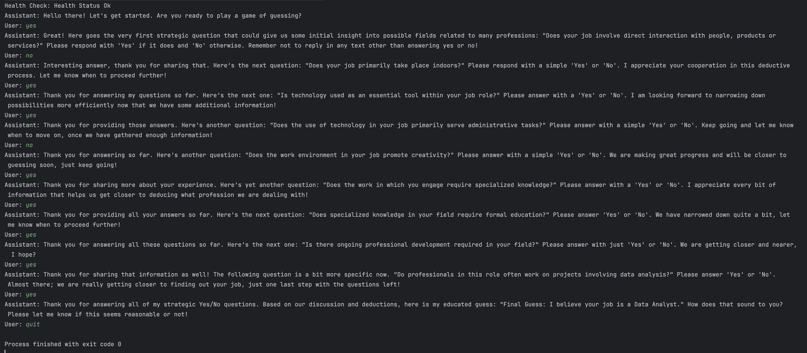

# Job Guesser
This is a LLM based Job Guesser which is capable of guessing user's job in max 20 attempts, based on user's Yes/No response to some queries.

## Tech:
This depends on the local OLLAMA server to use the specified model. Currently, the implementation is based on `phi3:mini` model.
The prompt to the model is defined in the `application.yml` file.

## Demo:
